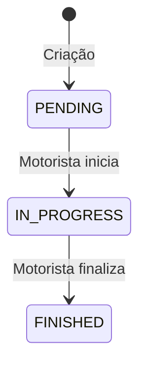

# PlusHealth Backend 🏥

[](https://nodejs.org/)
[](https://www.typescriptlang.org/)
[](https://www.postgresql.org/)

## Índice
- [Introdução](#introdução)
- [Funcionalidades](#funcionalidades)
- [Tecnologias Utilizadas](#tecnologias-utilizadas)
- [Como Executar](#como-executar)
- [Rotas da API](#rotas-da-api)
- [Estrutura do Projeto](#estrutura-do-projeto)
- [Melhorias Futuras](#melhorias-futuras)
- [Links](#links)

## Introdução
O **PlusHealth** é o sistema central de gestão para a rede de farmácias, responsável por:

✅ Gerenciamento de usuários (Administradores, Filiais e Motoristas)  
✅ Controle de estoque entre filiais  
✅ Rastreamento de movimentações de produtos  
✅ Autenticação segura de usuários  

Este projeto resolve o desafio de otimizar a logística de transferências de medicamentos entre as unidades da rede, garantindo controle preciso do estoque e auditoria completa das operações.

## Funcionalidades
| Módulo         | Recursos                                                      |
|----------------|---------------------------------------------------------------|
| **Usuários**   | Cadastro, autenticação JWT, perfis de acesso, atualização     |
| **Produtos**   | Cadastro, listagem com estoque, histórico de movimentações    |
| **Filial**     | Controle de endereço, documentos e produtos associados        |
| **Movimentação**| Criação, acompanhamento em tempo real, confirmação de entrega |

## Tecnologias Utilizadas
### Backend
- **Node.js** + **Express**
- **TypeScript**
- **TypeORM** (ORM)
- **Zod** (Validação de dados)
- **JWT** (Autenticação)

### Banco de Dados
- **PostgreSQL**

### Ferramentas
- **Insomnia** (Documentação de APIs)
- **Trello** (Gestão de tarefas)

## Como Executar
### Pré-requisitos
- Node.js 18.x
- PostgreSQL 15+
- NPM

### Passo a Passo
```bash
# 1. Clonar repositório
git clone https://github.com/lucasbbecker/projeto_modulo_2.git

# 2. Instalar dependências
npm install

# 3. Configurar ambiente
cp .env.example .env

# 4. No arquivo .env coloque as seguintes variáveis:

DB_HOST=localhost
DB_PORT=5432
DB_USERNAME="seu_user_name"
DB_PASSWORD="sua_senha_do_DB"
DB_NAME="nome_do_DB"
ADMIN_EMAIL="email_do_admin@gmail.com"
ADMIN_PASSWORD="senha_do_admin"
NODE_ENV=development
JWT_SECRET="sua_senha_secreta_aqui"
LOG_LEVEL=info
PORT=3000

# 5. Executar migrações
npm run migration:run

# 6. Criar Usuário Admnistrador
npm run seed

# 7. Iniciar servidor
npm run start

```


## Rotas da API

- O arquivo das requisições do Insomnia está na raiz do projeto **`Insomnia_projeto_modulo_2.json`**

### Endpoints

### 1. Criar Usuário (Somente ADMIN)
**`POST /users`**
```http
POST /users
Authorization: Bearer <ADMIN_TOKEN>
Content-Type: application/json

{
  "name": "Filial Joinville",
  "profile": "BRANCH",
  "email": "joinville@plushealth.com",
  "password": "123456",
  "document": "12.345.678/0001-99",
  "full_address": "Rua Blumenau, 1000"
}
```
### Resposta
```http
// Success (201)
{
  "id": 1,
  "name": "Filial Joinville",
  "profile": "BRANCH"
}
```
### 2. Login (Pública)
**`POST /login`**
```http
POST /login
Content-Type: application/json

{
  "email": "admin@gmail.com",
  "password": "123456"
}
```
### Resposta
```http
// Success (201)
{
  "token": "eyJhbGciOiJIUzI1NiIsInR5cCI6IkpXVCJ9...",
  "name": "Admin",
  "profile": "ADMIN"
}
```
### 3. Listar Usuários (Somente Admin)
**`GET /users?profile=BRANCH`**
```http
GET /users?profile=BRANCH
Authorization: Bearer <TOKEN>
```
### Resposta
```http
// Success (201)
[
  {
    "id": 1,
    "name": "Filial Joinville",
    "status": true,
    "profile": "BRANCH"
  }
]
```
### 4. Listar Usuários pela ID (Admin ou Motorista)
**`GET /users/:id`**
```http
GET /users/1
Authorization: Bearer <TOKEN>
```
### Resposta
```http
// Success (201)
[
  {
    "id": 1,
    "name": "Filial Joinville",
    "status": true,
    "profile": "BRANCH"
  }
]
```
### 5. Atualizar Usuário (Admin ou Motorista)
**`PUT /user/:id`**
```http
PUT /users/1
Authorization: Bearer <TOKEN>

{
  "name": "Filial Blumenau",
  "full_address": "Rua São Paulo, 123"
}
```
### Resposta
```http
// Success (201)
{
	"id": 3,
	"name": "Filial Blumenau",
	"profile": "BRANCH",
	"status": true,
	"full_address": "Rua São Paulo, 123",
	"document": "51421857000116"
}
```
### 6. Atualizar status do Usuário (Somente Admin)
**`PATCH /users/:id/status`**
```http
PATCH /users/1/status
Authorization: Bearer <ADMIN_TOKEN>

{ "status": false }
```
### Resposta
```http
// Success (201)
{
	"id": 1,
	"name": "Filial Blumenau",
	"profile": "BRANCH",
	"status": false
}
```
### 7. Criar Produto (Filial)
**`POST /products`**
```http
POST /products
Authorization: Bearer <BRANCH_TOKEN>
Content-Type: application/json

{
  "name": "Ibuprofeno 400mg",
  "amount": 150,
  "description": "Anti-inflamatório não esteroidal",
  "url_cover": "https://exemplo.com/ibuprofeno.jpg"
}
```
### Resposta
```http
// Success (201)
{
  "id": 28,
  "name": "Ibuprofeno 400mg",
  "amount": 150,
  "description": "Anti-inflamatório não esteroidal",
  "url_cover": "https://exemplo.com/ibuprofeno.jpg",
  "branch": {
    "id": 5,
    "document": "23.456.789/0001-01"
  },
  "created_at": "2025-03-05T14:30:00Z"
}
```
### 8. Listagem de Produtos (Filial)
**`GET /products`**
```http
GET /products
Authorization: Bearer <BRANCH_TOKEN>
```
### Resposta
```http
// Success (201)
[
  {
    "id": 28,
    "name": "Ibuprofeno 400mg",
    "amount": 150,
    "description": "Anti-inflamatório não esteroidal",
    "branch": {
      "id": 5,
      "full_address": "Av. das Américas, 5000",
      "document": "23.456.789/0001-01"
    },
    "created_at": "2025-03-05T14:30:00Z"
  }
]
```
### 9. Cadastro de Movimentação (Filial)
**`POST /movement`**
```http
POST /movements
Authorization: Bearer <BRANCH_TOKEN>
Content-Type: application/json

{
  "destination_branch_id": 6,
  "product_id": 28,
  "quantity": 30
}
```
### Resposta
```http
// Success (201)
{
  "id": 102,
  "status": "PENDING",
  "quantity": 30,
  "product": {
    "id": 28,
    "name": "Ibuprofeno 400mg"
  },
  "destination_branch": {
    "id": 6,
    "document": "34.567.890/0001-02"
  },
  "created_at": "2025-03-05T15:00:00Z"
}
```
### 10. Listagem de Movimentações (Filial ou Motorista)
**`GET /movements`**
```http
GET /movements
Authorization: Bearer <BRANCH_TOKEN>
```
### Resposta
```http
// Success (201)
[
  {
    "id": 102,
    "status": "PENDING",
    "quantity": 30,
    "product": {
      "id": 28,
      "name": "Ibuprofeno 400mg",
      "branch_origem": {
        "id": 5,
        "document": "23.456.789/0001-01"
      }
    },
    "destination_branch": {
      "id": 6,
      "full_address": "Rua das Flores, 300",
      "document": "34.567.890/0001-02"
    },
    "created_at": "2025-03-05T15:00:00Z"
  }
]
```
### 11. Iniciar Movimentação (Motorista)
**`PATCH /movements/:id/start`**
```http
PATCH /movements/:1/start
Authorization: Bearer <DRIVER_TOKEN>
```
### Resposta
```http
// Success (201)
{
	"id": 1,
	"quantity": 5,
	"status": "IN_PROGRESS",
	"created_at": "2025-03-03T20:28:22.493Z",
	"updated_at": "2025-03-05T01:05:40.154Z",
	"driver": {
		"id": 1,
		"full_address": "Rua Cidade de Petrolina, 456",
		"document": "10346897835",
		"created_at": "2025-03-02T16:25:08.021Z",
		"updated_at": "2025-03-03T15:52:34.443Z"
	}
}
```
### 12. Finalizar Movimentação (Motorista)
**`PATCH /movements/:id/end`**
```http
PATCH /movements/102/end
Authorization: Bearer <DRIVER_TOKEN>
```
### Resposta
```http
// Success (201)
{
	"id": 1,
	"quantity": 5,
	"status": "FINISHED",
	"created_at": "2025-03-03T20:28:22.493Z",
	"updated_at": "2025-03-05T01:14:50.441Z",
	"driver": {
		"id": 1,
		"full_address": "Rua Cidade de Petrolina, 456",
		"document": "10346897835",
		"created_at": "2025-03-02T16:25:08.021Z",
		"updated_at": "2025-03-03T15:52:34.443Z"
	},
	"product": {
		"id": 1,
		"name": "Dipirona",
		"amount": 55,
		"description": "A Dipirona Sódica é um analgésico e antitérmico utilizado em enfermidades que tenham dor e febre como sintomas.",
		"url_cover": "https://farma22.vtexassets.com/arquivos/ids/184800/compre-dipirona-1g.png?v=638144900800430000",
		"created_at": "2025-03-03T19:08:57.935Z",
		"updated_at": "2025-03-03T20:28:22.493Z"
	},
	"destinationBranch": {
		"id": 2,
		"full_address": "Rua petrópolis, 162",
		"document": "51421857000116",
		"created_at": "2025-03-03T20:25:37.491Z",
		"updated_at": "2025-03-03T20:25:37.491Z"
	},
	"sourceBranch": {
		"id": 1,
		"full_address": "Rua Blumenau, 695",
		"document": "51421857000116",
		"created_at": "2025-03-03T18:28:24.254Z",
		"updated_at": "2025-03-03T18:32:06.711Z"
	}
}
```
## Diagrama de Estados das Movimentações



## Estrutura do Projeto

```bash
📁 src/
├─📁 config/       # Configurações globais
├─📁 controllers/  # Lógica das rotas
├─📁 database/     # Script para criar o usuário Admin
├─📁 entities/     # Modelos do banco
├─📁 middlewares/  # Autenticação e validações
├─📁 migrations/   # Scripts de banco
├─📁 routes/       # Definição de endpoints
├─📁 schemas/      # Esquemas de validação
├─📁 services/     # Regras de negócio
├─📁 utils/        # Helpers e utilitários
```

## Melhorias Futuras

- Adicionar sistema de notificações
- Desenvolver módulo de relatórios

## Links

Vídeo de apresentação:

	https://drive.google.com/file/d/1fmdqKhNqsM9QK4enksmfgI5HFFKgoeiA/view?usp=sharing


Desenvolvido por Lucas Becker Barbosa Lima
Para - Módulo 2 DEVinHouse
